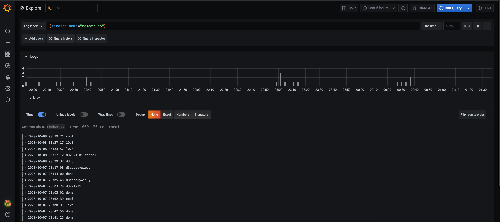
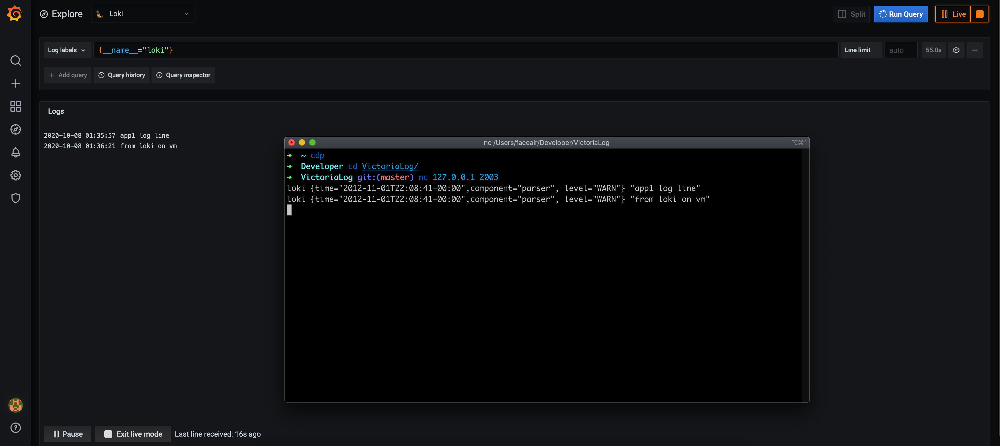

# Loki On VictoriaMetrics

This project experimentally supports the [loki](https://grafana.com/docs/loki/latest/overview/) protocol on the VictoriaMetrics Cluster, and the performance may be better than original loki.

More discussion can be found at [VictoriaMetrics#816](https://github.com/VictoriaMetrics/VictoriaMetrics/issues/816#issuecomment-705538059)

## Supported
* LogQL, extends MetricsQL to support [filter expressions](https://grafana.com/docs/loki/latest/logql/#filter-expression) and full PromQL & MetricsQL support for querying metrics.
* Major HTTP API
  * `/loki/api/v1/query`
  * `/loki/api/v1/query_range`
  * `/loki/api/v1/label` & `/loki/api/v1/labels`
  * `/loki/api/v1/label/<name>/values`
  * `/loki/api/v1/tail` (websocket)
  * `/loki/api/v1/push`
* Additional support for prometheus-style data writing via tcp, like `loki{component="parser",level="WARN"} "app log line"`

## How to build & run

```
$ make all
$ bin/vmstorage
$ bin/vmselect -storageNode 127.0.0.1:8401
$ bin/vminsert -storageNode 127.0.0.1:8400 -importerListenAddr 127.0.0.1:2003
```

Set loki datasource endpoint as `http://127.0.0.1:8481/select/0/`, If you call it manually, the full URL is `http://127.0.0.1:8481/select/0/loki/api/v1/query_range`.

Test insert logs with tcp:
```
$ nc 127.0.0.1 2003
loki{component="parser",level="WARN"} "app log line"
```

If you want to call push api to insert data, use `http://127.0.0.1:8480/insert/0/loki/api/v1/push`.

For more details, please refer to  [VictoriaMetrics Cluster](https://github.com/VictoriaMetrics/VictoriaMetrics/tree/cluster)

## Screenshot




